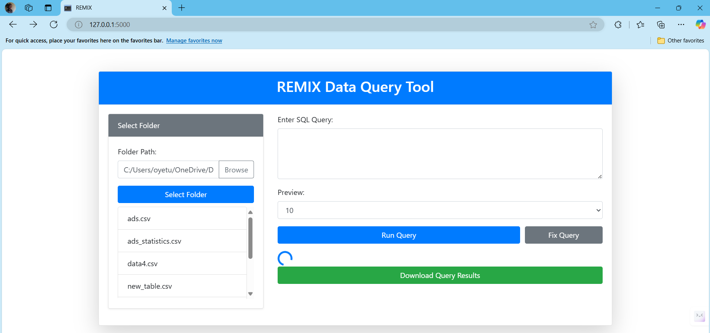
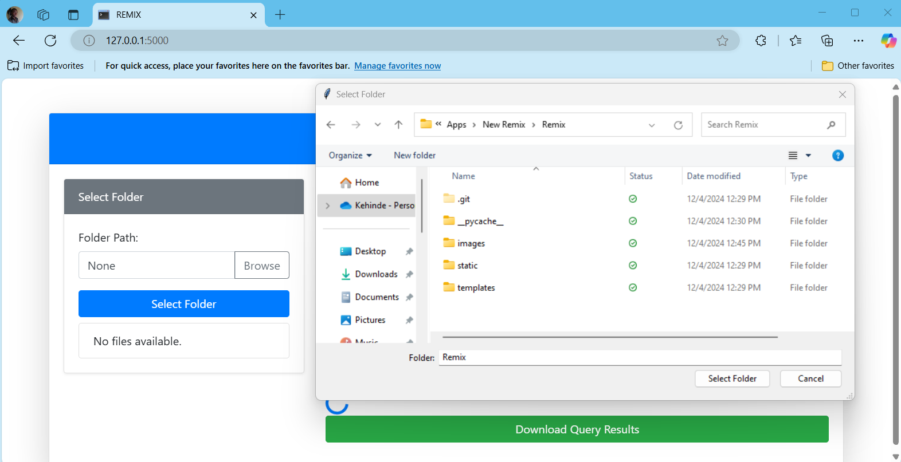
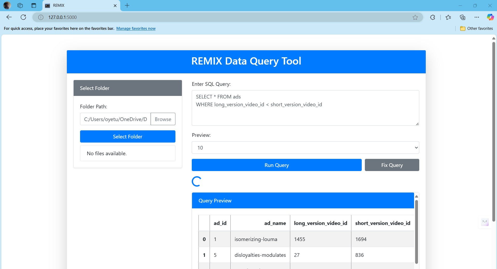
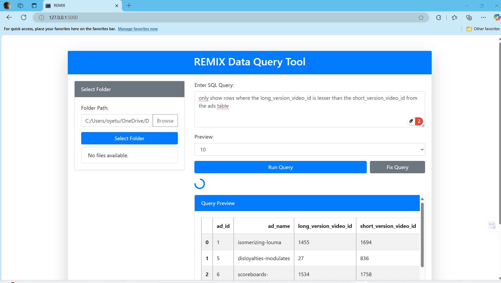
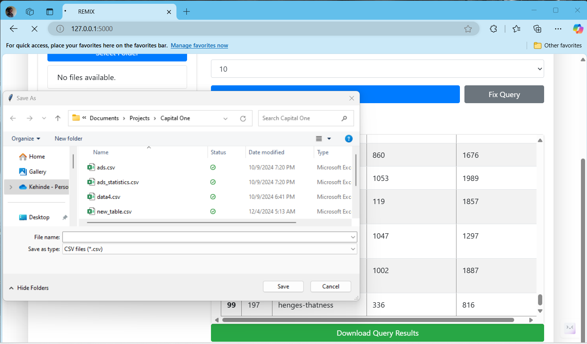
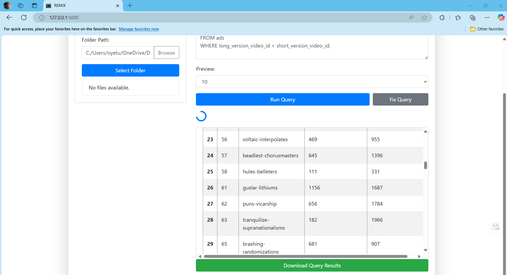

# ReMix: LLM-Enhanced SQL Query Assistant

An intuitive tool for querying and interacting with local datasets (CSV, Excel, JSON), powered by a Large Language Model (LLM) to assist in SQL query generation, fixing, and execution. This lightweight application combines simplicity with AI-driven capabilities to make data querying more accessible and efficient.


---

## Features
- **Folder Selection**: Browse and load local datasets dynamically.

- **SQL Query Execution**: Run SQL queries on structured data with real-time previews.

- **LLM-Powered Query Fixing**: Automatically fix broken SQL queries or generate SQL queries from plain-text prompts using an integrated LLM.

- **Data Export**: Download query results as a CSV file for further analysis.

- **Interactive Interface**: User-friendly web interface built with Flask and Bootstrap.

---

## Tech Stack
- **Backend**: Flask, Pandas, pandasql
- **Frontend**: Bootstrap 4, HTML, JavaScript
- **AI Integration**: Groq API for LLM-based query generation and fixing
- **Environment Management**: dotenv for secure key storage

---

## Requirements
- Python 3.8 or higher
- Libraries:
  - Flask
  - pandas
  - pandasql
  - python-dotenv
  - Groq API SDK

---

## Setup Instructions

### 1. Clone the Repository
```bash
git clone https://github.com/kennybix/remix.git
cd remix
```

### 2. Install Dependencies
Use pip to install the required Python libraries:

bash
Copy code
pip install -r requirements.txt

### 3. Set Up Environment Variables
Create a .env file in the project root and add your API keys:

```makefile
Copy code
GROQ_API_KEY=your_groq_api_key_here
```

### 4. Run the Application
Start the Flask server:

```bash
Copy code
python app.py
Access the application at: http://127.0.0.1:5000/
```
---

### Usage Guide

## Folder Selection
# 1. Click the "Browse" button to select a folder containing your datasets.
# 2. The files in the selected folder will be displayed on the left-hand side.

## SQL Query Execution
Write or paste your SQL query in the input box.
Click "Run Query" to execute and preview the results.
Adjust the number of preview rows using the dropdown menu.

## LLM Query Assistance
Enter a plain-text prompt or an incomplete SQL query.
Click "Fix Query" to generate or correct the query using the LLM.
The fixed query will replace the input.

## Export Results
After running a query, click "Download Query Results" to save the output as a CSV file.

---

Key Features in Action
Natural Language to SQL Conversion:
Enter: "List all employees earning more than $50,000"
LLM generates: SELECT * FROM employees WHERE salary > 50000;
Broken Query Fixing:
Input: SELEC * FROM employees
Fixed: SELECT * FROM employees;
Future Enhancements
Support for additional file formats (Parquet, Avro).
Distributed querying capabilities.
Integration with cloud storage (S3, Google Drive).
Advanced AI-driven insights (e.g., summarization, trend detection).


